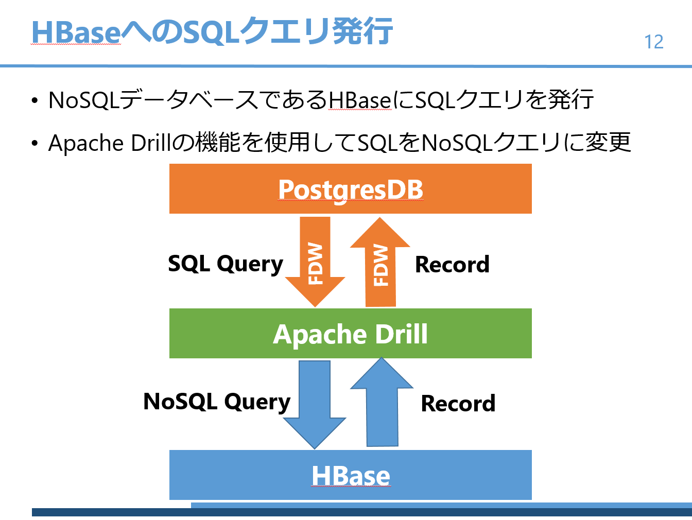

# SQL2HBase
Apache Drill等を使用することで、HBaseに対してPostgreSQLからSQLクエリを発行します。

## システム構成図

## TODO after `docker-compose up`

2018/2/28時点で起動後にしなければならない処理一覧

### Hbaseコンテナ
* ./start-hbase.shを実行する
* サンプルファイルをhbase shellに流し込む

### apache-drillコンテナ

* ./drill-embeddedを実行する
* web consoleからhbaseプラグインのzookeeper.quorumをlocalhostからhbaseに変更する

### postgresqlコンテナ

* ./etc/init.d/postgres start を実行してDBを起動する
* psqlからjdbc_options.sqlを流し込んでextensionを起動する。　
